# Installer LAMP dans WSL2


## Pourquoi WSL?

> « WSL vous permet d'exécuter un environnement Linux - y compris des outils de ligne de commande et des applications - directement sous Windows, sans les inconvénients d'une machine virtuelle traditionnelle ou d'une configuration en *dual boot*. [...] Lorsque vous installez une version de Linux sur Windows, vous obtenez un environnement Linux complet. Il est isolé de Windows - l'interface utilisateur est le terminal, et vous pouvez installer des outils, des langages et des compilateurs dans l'environnement Linux sans modifier ou perturber votre installation Windows. »
> Source : [Remote - WSL](https://marketplace.visualstudio.com/items?itemName=ms-vscode-remote.remote-wsl)


## Prérequis

> Téléchargez et installez [Visual Studio Code](https://code.visualstudio.com/Download)

- Pour une meilleure intégration de VSCode dans Windows, cochez les deux cases suivantes :


## Installer Debian dans WSL2

### Dans Windows 11

- Exécutez PowerShell en tant qu'administrateur :


- Tapez la commande pour connaître les distributions disponibles :

```
wsl --list --online
```

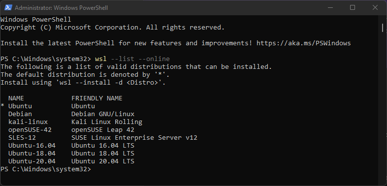

- Installez Debian : 

```
wsl --install -d Debian
```

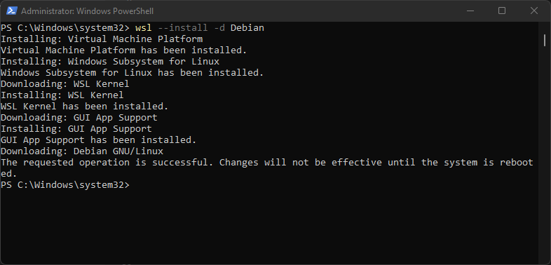

- Redémarrez le système (des mises-à-jour du système se produiront pendant l'arrêt et le redémarrage : c'est normal !) 

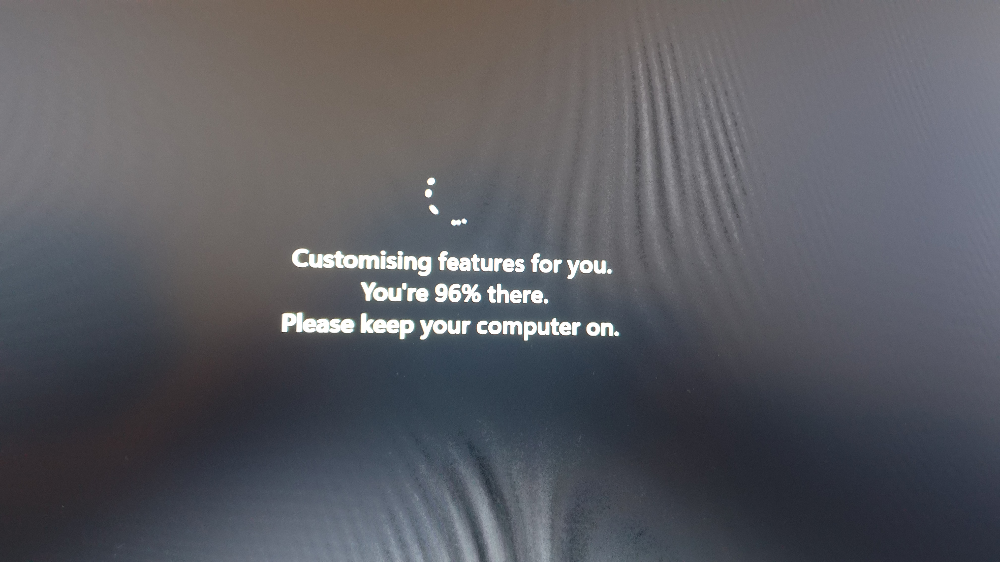

> Cette étape n'est nécessaire que la première fois que vous installez une distribution Linux avec WSL2. Si vous faites une nouvelle installation, vous n'aurez pas besoin de redémarrer. 

### Configurez Debian

> ⚠️ Si vous avez le moindre problème, un message d'erreur, etc. ne paniquez pas ! Dans Powershell, en tant qu'administrateur, tapez :
> ```
> wsl --unregister Debian
> ```
> Puis recommencez l'installation.

- Lancez le terminal Debian : 

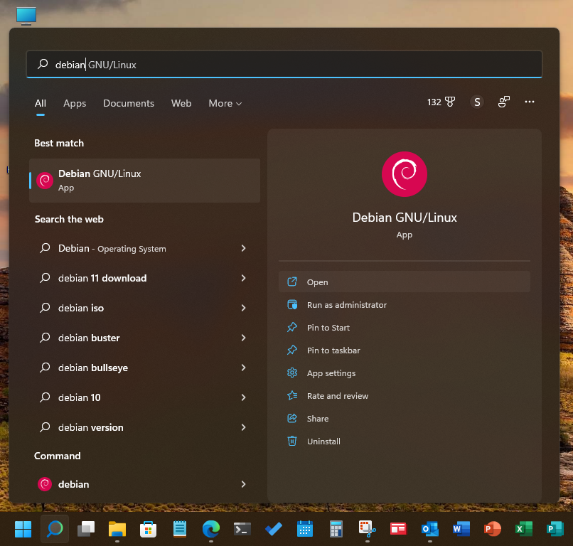

> ⚠️ Si à un moment dans le terminal Debian un processus dure trop longtemps, appuyez sur les touches `CTRL` + `C` de votre clavier pour arrêter le processus.

- Attendez quelques secondes, puis configurez le nom d'utilisateur d'un nouvel utilisateur, et un nouveau mot de passe :


> Sur les systèmes de type Unix (comme Linux), lorsque vous tapez un mot de passe, pour des raisons de sécurité, rien ne s'affiche. C'est normal !

- Installez des paquets supplémentaires :
```
sudo apt install -y software-properties-common curl wget openssh-server net-tools
```

- Vérifier la version installée de Debian :
```
cat /etc/debian_version
```
  

### [Optionnel] Ne plus avoir à taper le mot de passe

```
sudo nano /etc/sudoers
```

- A la dernière ligne du fichier, collez :

```bash
# NO PASSWORD
%sudo   ALL=(ALL:ALL) NOPASSWD:ALL
```


## Installer MariaDB

```
sudo apt install -y mariadb-server
```

- Vérifiez la version pour s'assurer que MariaDB est installé :

```
mysql --version
```

> Si un numéro de version est affiché, c'est que tout est bon !

- Démarrez le service : 

```
sudo service mariadb start
```

> D'autres commandes qui peuvent vous être utiles :  `sudo service mariadb status`, `sudo service mariadb stop`, `sudo service mariadb restart`.

-  Maintenant, lancez le script [mysql_secure_installation](https://mariadb.com/kb/en/mysql_secure_installation/) (cela permet d'améliorer la sécurité de votre installation MariaDB): 

```
sudo mysql_secure_installation
```

- Appuyez sur la touche `Entrer` de votre clavier lorsque le script demande de renseigner le mot de passe actuel de `root`, puis, répondez systématiquement `Y` (*yes*) à toutes les questions (et bien sûr, définissez le nouveau mot de passe pour `root`) :

```
NOTE: RUNNING ALL PARTS OF THIS SCRIPT IS RECOMMENDED FOR ALL MariaDB
      SERVERS IN PRODUCTION USE!  PLEASE READ EACH STEP CAREFULLY!
In order to log into MariaDB to secure it, we'll need the current
password for the root user. If you've just installed MariaDB, and
haven't set the root password yet, you should just press enter here.
Enter current password for root (enter for none):
OK, successfully used password, moving on...
Setting the root password or using the unix_socket ensures that nobody
can log into the MariaDB root user without the proper authorisation.
You already have your root account protected, so you can safely answer 'n'.
Switch to unix_socket authentication [Y/n] y
Enabled successfully!
Reloading privilege tables..
 ... Success!
You already have your root account protected, so you can safely answer 'n'.
Change the root password? [Y/n] y
New password:
Re-enter new password:
Password updated successfully!
Reloading privilege tables..
 ... Success!
By default, a MariaDB installation has an anonymous user, allowing anyone
to log into MariaDB without having to have a user account created for
them.  This is intended only for testing, and to make the installation
go a bit smoother.  You should remove them before moving into a
production environment.
Remove anonymous users? [Y/n] y
 ... Success!
Normally, root should only be allowed to connect from 'localhost'.  This
ensures that someone cannot guess at the root password from the network.
Disallow root login remotely? [Y/n] y
 ... Success!
By default, MariaDB comes with a database named 'test' that anyone can
access.  This is also intended only for testing, and should be removed
before moving into a production environment.
Remove test database and access to it? [Y/n] y
 - Dropping test database...
 ... Success!
 - Removing privileges on test database...
 ... Success!
Reloading the privilege tables will ensure that all changes made so far
will take effect immediately.
Reload privilege tables now? [Y/n] y
 ... Success!
Cleaning up...
All done!  If you've completed all of the above steps, your MariaDB
installation should now be secure.
Thanks for using MariaDB!
```

- Puis :

```
sudo mysql -u root -p
```

- Personnalisez le *nom d'utilisateur* et le *mot de passe* :

```
CREATE USER 'username'@'localhost' IDENTIFIED BY 'password';
GRANT ALL PRIVILEGES ON *.* TO 'username'@'localhost';
EXIT
```


## Installer Apache

```
sudo apt install -y apache2
```

- Démarrez le service : 

```
sudo service apache2 start
```

> Comme pour MariaDB, il existe d'autres commandes qui peuvent être utiles : `sudo service apache2 status`, `sudo service apache2 stop`, `sudo service apache2 restart`.

- Pour pouvoir travailler dans le répertoire `www` et non dans le répertoire `html`, nous allons modifier la configuration d'Apache :

```
sudo nano /etc/apache2/sites-enabled/000-default.conf
```

- Modifiez ```DocumentRoot /var/www/html``` pour ```DocumentRoot /var/www```.


- Puis modifiez les permissions:

```
sudo chgrp $(id -u) -R /var/www && sudo chown www-data -R /var/www && sudo chmod 775 -R /var/www
```

- Renommez le répertoire `html` en `00_setup`:

```
mv /var/www/html /var/www/00_setup
```

- Et le fichier `index.html` en `apache2.html`:

```
mv /var/www/00_setup/index.html /var/www/00_setup/apache2.html
```

- L'expérience m'a appris que devons faire une dernière chose. Dans votre terminal, tapez : 

```
sudo nano /etc/apache2/apache2.conf
```

- Sur la dernière ligne du fichier, collez :

```
# Disables accept filters for HTTPS connections, making Apache accept connections immediately without waiting for data.
AcceptFilter https none
```

> Appuyez sur les touches `CTRL` + `O` de votre clavier pour écraser, confirmez en appuyant sur `Entrer`, et quittez nano en appuyant sur `CTRL` + `X`.


- Re-démarrez le service : 

```
sudo service apache2 restart
```

- Dans la barre d'URL de votre navigateur, tapez `http://localhost/00_setup/apache2.html` :


## Installer PHP

```
sudo apt -y install lsb-release apt-transport-https ca-certificates 
```

- Téléchargez la *GPG Key* (clé de chiffrement et de déchiffrement) du dépôt sur lequel nous allons récupérer les paquets :

```
sudo curl -sSL -o /etc/apt/trusted.gpg.d/php.gpg https://packages.sury.org/php/apt.gpg
```

- Ajoutez le dépôt :

```
sudo sh -c 'echo "deb https://packages.sury.org/php/ $(lsb_release -sc) main" > /etc/apt/sources.list.d/php.list'
```

- Mettez-à-jour la liste des paquets :

```
sudo apt update && sudo apt -y upgrade && sudo apt -y autoremove
```

- Ensuite, installez PHP 8.3 et les extensions PHP les plus utilisées :

```
sudo apt -y install php8.3 libapache2-mod-php8.3 php8.3-{bcmath,bz2,intl,gd,mbstring,mysql,zip,curl,dom,cli,xml,common,opcache,imagick}

```

> Vous pouvez utiliser `php -v` pour vérifier la version de PHP, et `php -m` pour vérifier quelles extensions sont installées.

- Vous devez redémarrer Apache pour que les modifications soient prises en compte :

```
sudo service apache2 restart
```

- Vous pouvez créer un fichier pour afficher votre configuration PHP :

```bash
echo -e "<?php\n\nphpinfo();\n\n// EOF" >> /var/www/00_setup/phpinfo.php
```

- Dans la barre d'URL de votre navigateur, tapez `http://localhost/00_setup/phpinfo.php` :

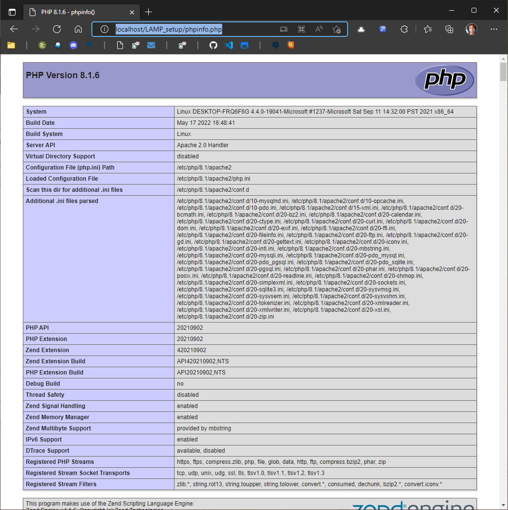


### Les erreurs en PHP

```
sudo nano /etc/php/8.3/apache2/php.ini
```

- Trouvez ces 2 lignes dans le fichier :

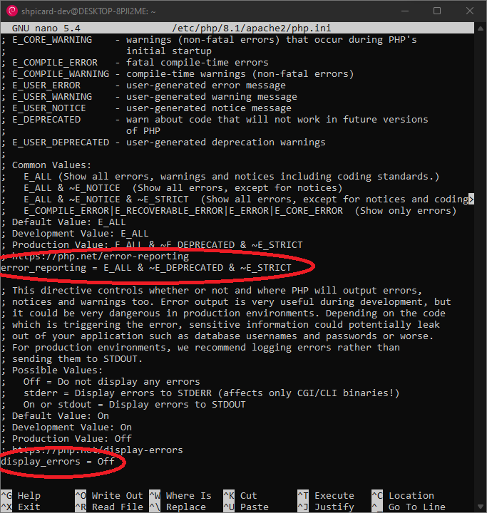

-  Changez la valeur par défaut de `error_reporting` qui est `E_ALL & ~E_NOTICE & ~E_STRICT & ~E_DEPRECATED` pour `E_ALL` et la valeur par défaut de `display_errors` qui est à `Off` pour `On` :

```
error_reporting = E_ALL
display_errors = On
```

> Appuyez sur les touches `CTRL` + `O` de votre clavier pour écraser, confirmez en appuyant sur `Entrer`, et quittez nano en appuyant sur `CTRL` + `X`.

⚠️ Attention, nous configurons un environnement de développement local... Sur un serveur de production, ne passez jamais display_errors à On !

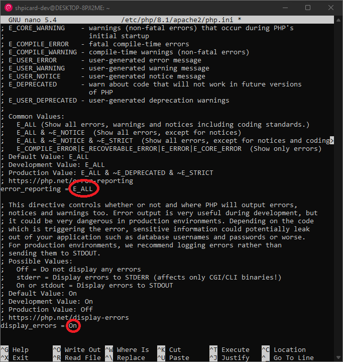

> Afficher les journaux d'erreurs lorsque vous déboguez votre code en PHP : `cat /var/log/apache2/error.log`


## Installer Adminer

```
sudo apt install -y adminer
```

- Activez le fichier conf pour Apache :

```
sudo a2enconf adminer
```

- Enfin, redémarrez Apache :

```
sudo service apache2 restart
```

- Dans la **barre URL** de votre navigateur, tapez : 

```
localhost/adminer
```

> ⚠️ N'oubliez pas de lancer `sudo service mariadb start`.

- Connectez-vous avec le nom d'utilisateur et le mot de passe que vous avez définis lors de l'installation de MariaDB :


- Ça marche :


## Installer GIT

```
sudo apt install git -y
```

- Changez `your-username` et `your-mail@example.com` :

```
git config --global user.name your-username
git config --global user.email your-mail@example.com
git config --global init.defaultBranch main
```

- Vous pouvez modifier ces informations à tout moment :

```
sudo nano ~/.gitconfig
```

> Appuyez sur les touches `CTRL` + `O` de votre clavier pour écraser, confirmez en appuyant sur `Entrer`, et quittez nano en appuyant sur `CTRL` + `X`.

### S'authentifier avec une clé SSH sur GitHub

> Bien sûr, vous devez avoir un compte GitHub. Si vous n'en avez pas, créez votre compte GitHub : [Join GitHub](https://github.com/join)

- Générez votre clé SSH : 

> Conservez les valeurs par défaut et ne saisissez pas de phrase de passe.

```
ssh-keygen -t rsa -b 2048
```


- Affichez votre clé SSH et copiez-la :

```
cat ~/.ssh/id_rsa.pub
```

- Ensuite, vous devez le coller dans `SSH Keys` dans les paramètres de votre compte GitHub. Connectez-vous avec votre compte et allez dans `Settings` :


- Collez votre clé SSH :

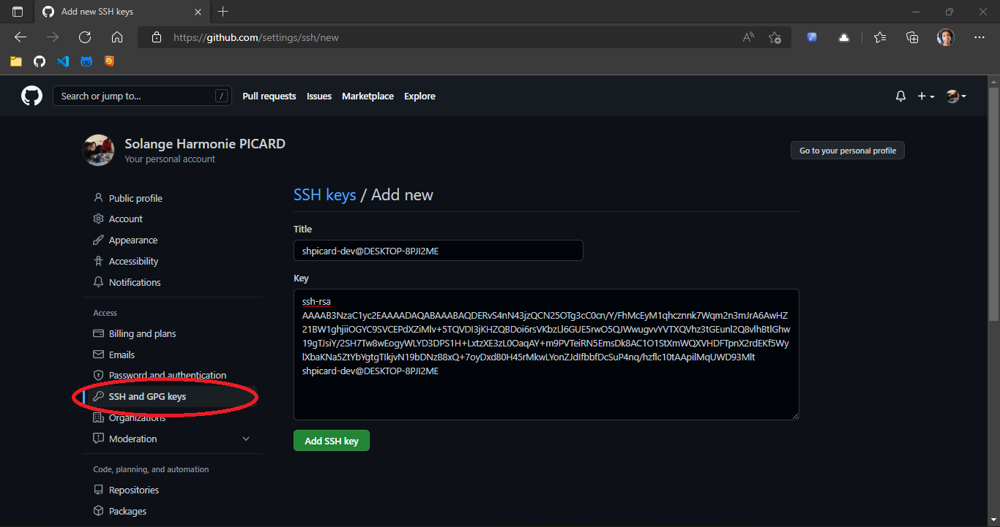

- Résultat : 

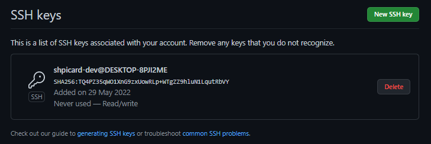

- Lorsque vous faites votre premier commit, vous devrez autoriser la connexion entre VSCode et github :

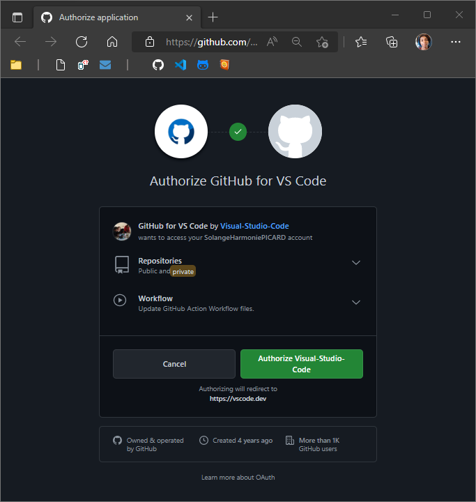

## Installer « Remote - WSL » dans VSCode 

- Installez [Remote - WSL](https://aka.ms/vscode-remote/download/wsl):

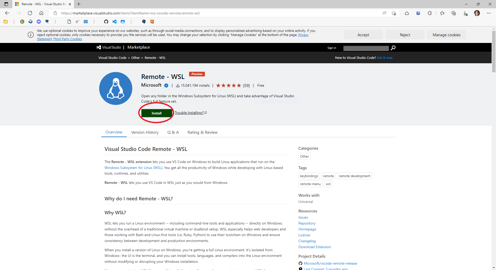

- Validez l'ouverture de l'extension dans VSCode :

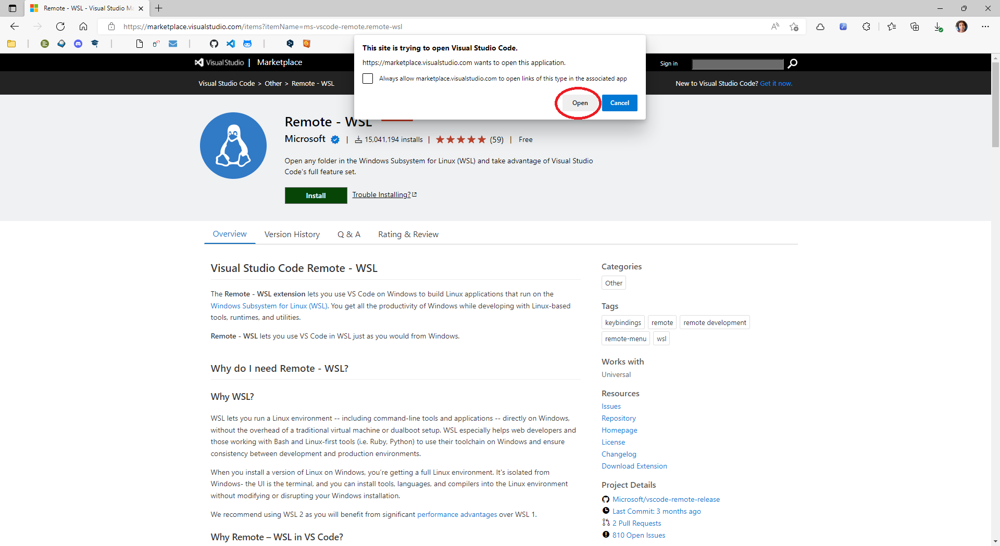

- Installez l'extension dans VSCode :

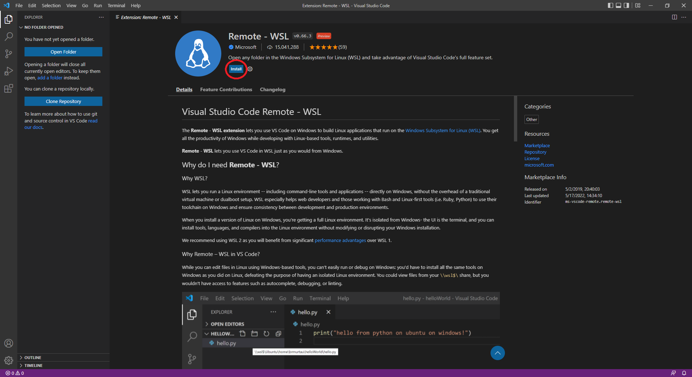


## Init

```
sudo nano ~/.bashrc
```

- A la dernière ligne du fichier, collez :

```bash
if [[ "$TERM_PROGRAM" != "vscode" ]]; then

        # Start apache2, mariadb & postfix
        sudo service apache2 start && sudo service mariadb start && sudo service postfix start

        # Init VSCode (Remote WSL)
        code /var/www

        # Init MailDev
        maildev --ip 127.0.0.1

fi
```

- Fermez votre terminal Debian et relancez-le, VSCode s'ouvre dans le répertoire `www`, vous devez "faire confiance aux auteurs des fichiers de ce dossier" :

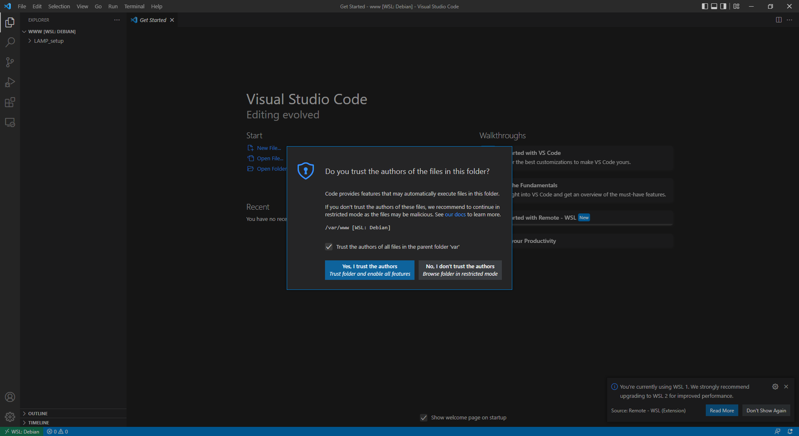

## 🎉 C'est terminé !

- Félicitations ! Vous avez terminé la configuration de votre environnement local de développement PHP/SQL !

- Comment l'utiliser ? Tout simplement en lançant Debian dans Windows 11, ce qui va démarrer Apache, MariaDB, Postfix, puis Visual Studio Code (qui se connecte directement à votre répertoire www), et enfin MailDev. 

- Vous pouvez minimiser le terminal Debian, et il n'est plus nécessaire d'y toucher tant que vous développez. Ce terminal, vous ne pouvez pas l'utiliser car il fait tourner MailDev et vous n'avez donc pas la main pour entrer de nouvelles lignes de commande. Pour utiliser un terminal, dans VSCode, dans le menu `Terminal`, choisissez `Nouveau terminal` : un terminal Debian intégré s'ouvre.

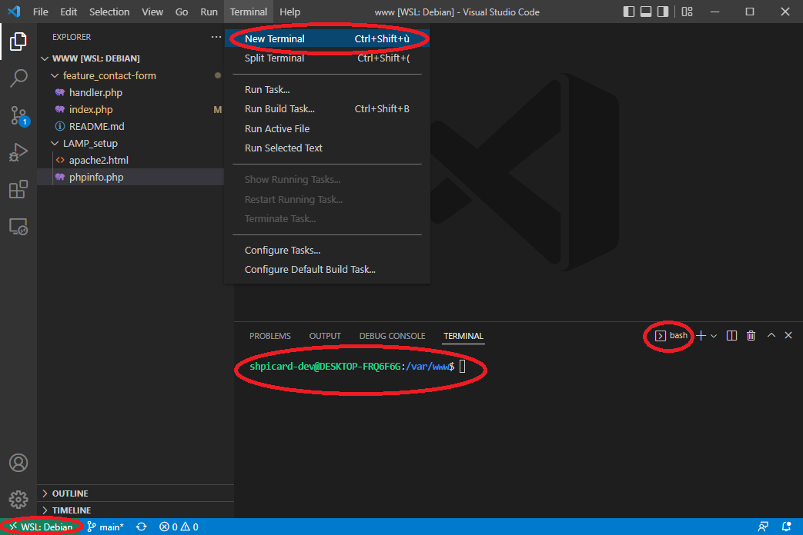


## Installer Node.js

```
curl -o- https://raw.githubusercontent.com/nvm-sh/nvm/v0.39.1/install.sh | bash
```

- ⚠️ Fermez le terminal Debian et redémarrez-le.

```
command -v nvm
```

> Si cela renvoie `nvm`, ça fonctionne !

- Installez la version stable LTS actuelle de Node.js :

```
nvm install --lts
```

- Installez la version actuelle de Node.js : 
```
nvm install node
```

> Lister les versions de Node qui sont installées : `nvm ls`.

## Resources

- [Official Microsoft Documentation](https://docs.microsoft.com/fr-fr/windows/wsl/install)
- [WSL2 Guide for Debian](https://gist.github.com/xnebulr/c769f26bffd41db2667d1f9de9f8ce5a)
- [PHP.Watch](https://php.watch/versions)

## Outils
- [Debian](https://www.debian.org/)
- [The GNU Nano Text Editor Homepage](https://www.nano-editor.org/)
- [MariaDB Foundation](https://mariadb.org/)
- [The Apache Software Foundation](https://apache.org/)
- [PHP](https://www.php.net/)
- [The Postfix Home Page](http://www.postfix.org/)
- [MailDev](https://maildev.github.io/maildev/)
- [Adminer](https://www.adminer.org/)
- [git](https://git-scm.com/)
- [GitHub](https://github.com/)
- [Visual Studio Code](https://code.visualstudio.com/)
